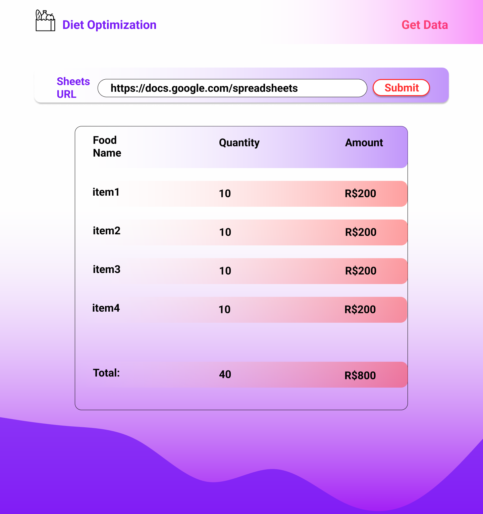

# DietOptimizationFrontend

Frontend construido para consumir a API - [DietOptimization](https://github.com/withoutCoffee/DietOptimization).

A aplicação foi construida com objetivo de prover parte visual facilitar uso do usuário.✌

### Mockup figma.

**Home**

**Run**

💻Tecnologias utilizadas:
 - HTML
 - CSS
 - JavaScript
